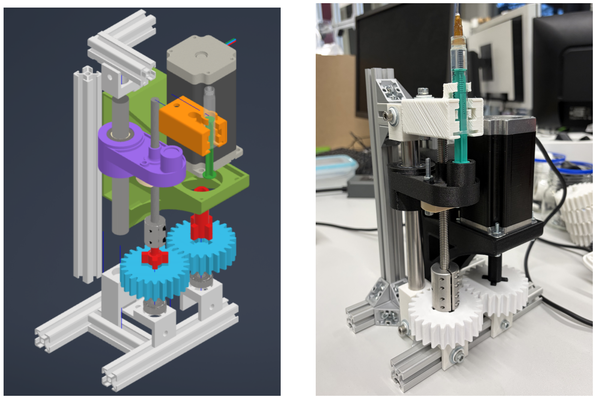
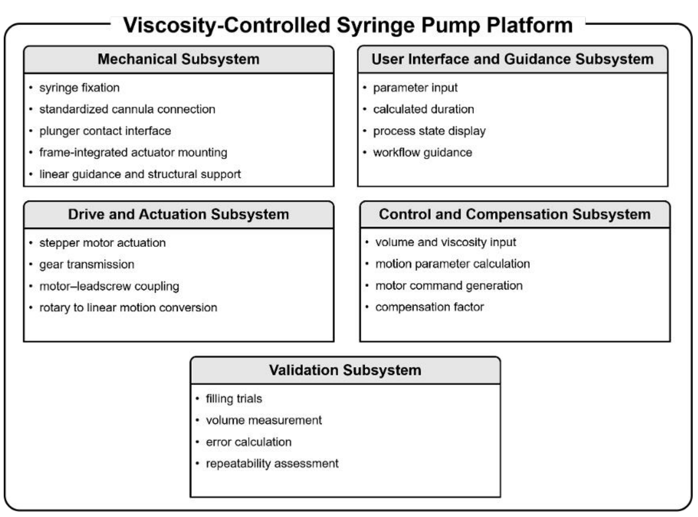
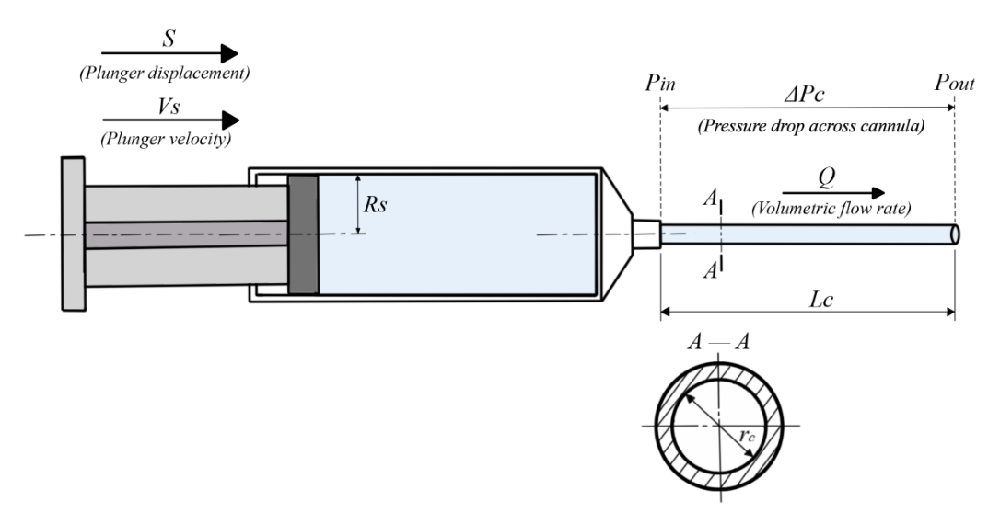
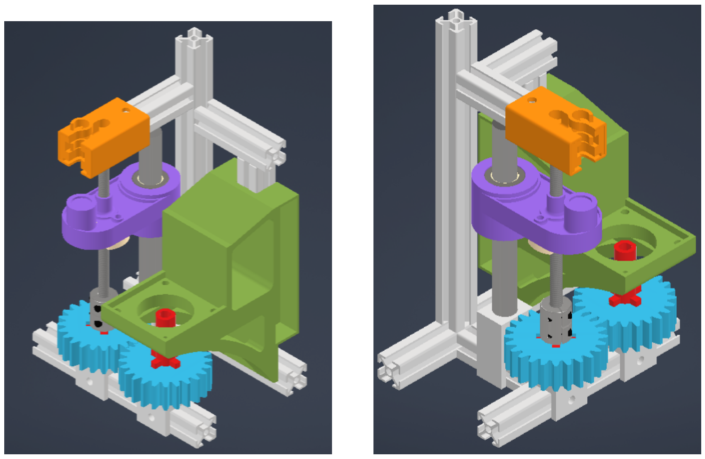
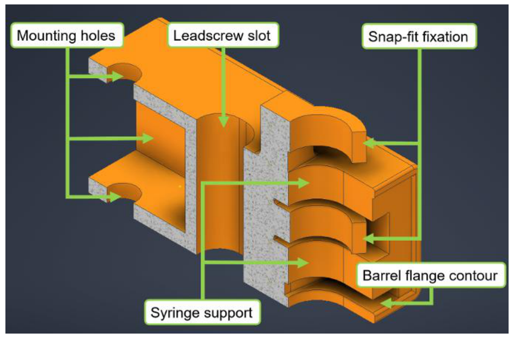
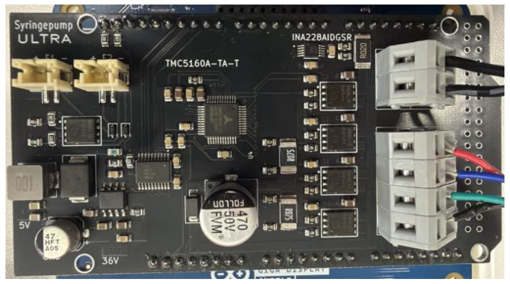
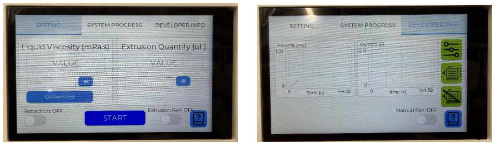
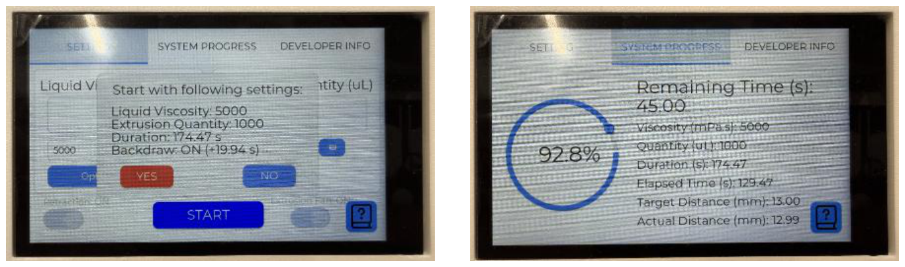
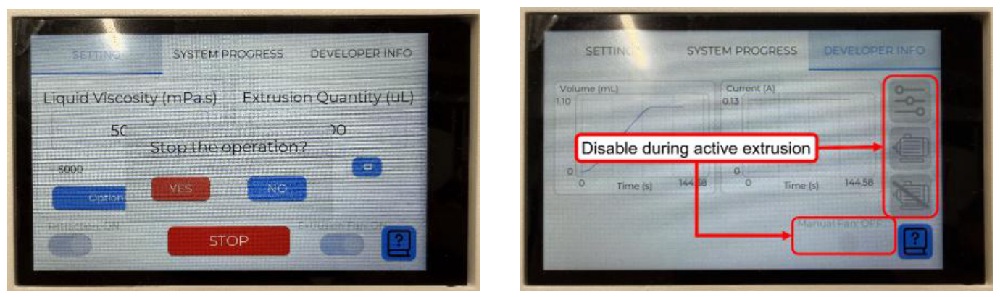
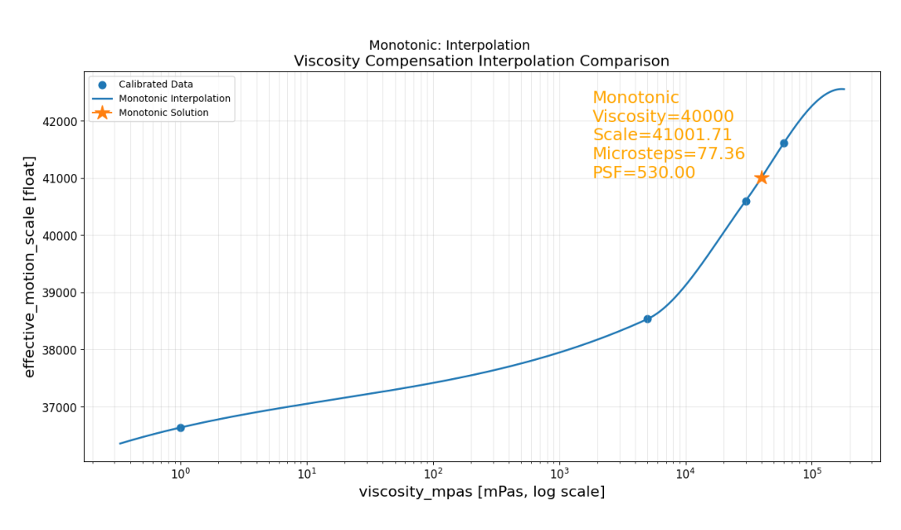

# Viscosity-Controlled Syringe Pump for Precise Filling of a Urological Implant with High-Viscosity Oils

**Master's Thesis — I-En Lee**  
M.Sc. Computational Engineering  
Friedrich-Alexander-Universität Erlangen-Nürnberg (FAU)  
Institute for Factory Automation and Production Systems (FAPS)  
2026

**Thesis grade: 1.0 (highest possible grade in the German grading system)**  
**Recognition: Outstanding Master's Thesis** — [View certificate](https://github.com/IEn-Lee/Master-Thesis_Viscosity-Controlled-Syringe-Pump/blob/main/Certificate%20Outstanding%20Master's%20Thesis_Lee.pdf) 
**Full master's thesis:** The complete thesis is available as a PDF in this repository — [Full master's thesis](https://github.com/IEn-Lee/Master-Thesis_Viscosity-Controlled-Syringe-Pump/blob/main/Master_s%20Thesis.pdf).  
*(If GitHub fails to display the PDF preview, please download the file and open it locally)*  
 
> **RheoPilot | James Dyson Award 2026**  
> **[Explore the RheoPilot project on the James Dyson Award website](https://www.jamesdysonaward.org/en-US/2026/project/rheopilot)**

---

## Overview

This master's thesis developed **RheoPilot**, a **viscosity-controlled syringe pump for precise filling of a urological implant with high-viscosity oils**. The platform combines physical modeling, mechanical design, embedded control, sensor–actuator integration, a touchscreen interface, and experimental calibration in a working laboratory prototype.

The investigated fluids spanned approximately **1–60,000 mPa·s**, from water to high-viscosity silicone oils. The system was developed around **B. Braun Injekt Luer Lock Solo 2 mL syringes** and a narrow cannula, with a validation target of **1 mL delivery within ±1% volumetric deviation** under defined laboratory conditions.

  

*Figure 1. From CAD to a test-ready prototype. Left: installation reference. Right: the assembled syringe pump used for experimental evaluation. Source: original thesis Figure 39.*

**Key results**

- **Calibrated conditions:** maximum absolute volumetric deviation of **0.62%** across the reported trials at 1, 5,000, 30,000, and 60,000 mPa·s.
- **Intermediate validation:** at a nominal **40,000 mPa·s**, which was not a calibration point, **all five trials met the ±1% tolerance** using interpolated parameters without additional manual retuning.
- **Validation accuracy:** maximum absolute deviation of **0.93%** and mean absolute deviation of **0.72%** at that intermediate condition.
- **Post-extrusion handling:** retracting the plunger-contact interface enabled a standardized **3-minute post-release waiting interval** for the oil-based tests.

## Why This Research Was Needed

RheoPilot originated from a medical-device research challenge: precisely filling an internal component of an intraurethral implant with high-viscosity oil through a narrow cannula. The task required accurate small-volume delivery, repeatable syringe positioning, controlled mechanical loading, and a practical laboratory workflow.

**Accurate plunger movement alone does not guarantee accurate delivery at the outlet.** Under high-viscosity conditions, hydraulic resistance, syringe compliance, plunger friction, structural deformation, and delayed outflow can cause the delivered volume to differ from the volume calculated from actuator displacement.

In the thesis experiments, the uncompensated setting produced a mean absolute volumetric deviation of **30.31% at 60,000 mPa·s**, despite relatively consistent repeated trials. This indicated a systematic process deviation that required application-specific compensation.

### The Gap Between Existing Approaches

The thesis examined three types of existing filling approaches in relation to the intended application:

| Existing approach | Relevant capability | Additional requirement for this research |
|---|---|---|
| **Conventional syringe pumps** | Programmable syringe actuation based on volume, flow rate, and syringe geometry. | Compensation for viscosity-dependent behavior, mechanical compliance, and delayed release in the specific syringe–cannula setup. |
| **Industrial high-viscosity dispensers** | Specialized metering of viscous materials. | Compatibility with the specified disposable 2 mL syringe and small-cannula implant-filling workflow. |
| **Manual or semi-automated filling** | Flexible operation during laboratory preparation and early development. | More reproducible actuation, documented process settings, and standardized post-extrusion handling. |

*This comparison summarizes the application-specific assessment in thesis Section 3.2 and Table 1, rather than an exhaustive comparison of all commercial products.*

The research therefore aimed to bring **syringe-based operation, viscosity-dependent compensation, modular hardware, and guided control** together in a compact laboratory platform.

## What Makes RheoPilot Different

**RheoPilot combines application-specific fluid modeling and calibration with an adaptable desktop device.** Its distinguishing value lies in how its mechanical design, embedded software, and operating procedure work together.

### 1. Viscosity-Aware Dispensing

Target volume and fluid viscosity are used to prepare the motion command. The physical model informs operating constraints, while experimentally calibrated compensation addresses differences between ideal plunger displacement and actual delivered volume.

A monotonic interpolation map estimates compensation settings between calibrated viscosities. At the nominal **40,000 mPa·s** validation condition, all five trials met the **±1% volumetric tolerance** without additional manual retuning.

### 2. Guided, Standalone Operation

Routine operation focuses on **two main inputs: target volume and fluid viscosity**. The embedded controller performs the calculations, controls the motor, and provides touchscreen guidance directly on the device.

Advanced settings remain available for research and configuration. Confirmation dialogs, process-state displays, and protected controls support a repeatable operating sequence.

### 3. Modular Hardware and Practical Fabrication

The platform combines standard components, a disposable syringe, custom motor-driver electronics, and replaceable 3D-printed parts.

DFM and DfAM considerations support practical assembly and modification, including a quick-release syringe holder, tolerance-aware contact interfaces, and modular mechanical connections. Researchers can adapt the hardware to their experimental requirements, followed by appropriate recalibration and validation.

### 4. Accessible Prototype Construction

The [RheoPilot project page on the James Dyson Award website](https://www.jamesdysonaward.org/en-US/2026/project/rheopilot) reports estimated **prototype parts costs of approximately €300–450**.

This construction approach supports the goal of making configurable high-viscosity dispensing more accessible to research laboratories. The estimate refers to prototype parts, rather than a commercial selling price or the total cost of development and validation.

### 5. A Defined Post-Extrusion Procedure

The filling workflow also addresses what happens after the motor stops. Retracting the plunger-contact interface releases the pushing contact and allows passive relaxation of the syringe–fluid system.

The oil-based experiments used a standardized **3-minute post-release waiting interval**, making post-extrusion handling part of the validated procedure.

Figures 1, 4, and 5 illustrate the prototype and mechanical interfaces; Figures 7–9 show the guided user interface; and Figure 10 presents the viscosity-dependent compensation map.

**The reported accuracy applies to the tested configuration and laboratory conditions. Changes to the syringe, cannula, fluid, or operating conditions require appropriate calibration and validation.**

## My Contributions

- Developed a fluid-mechanical model and used Python for numerical evaluation of viscosity-dependent operating constraints.
- Designed the syringe fixation, plunger-contact interface, guidance, actuator mounting, and transmission interfaces in CAD.
- Applied **DFM and DfAM considerations**, including assembly clearances, printed-part tolerances, modular interfaces, and replaceable components.
- Integrated stepper-motor actuation, motor-driver electronics, electrical monitoring, embedded C/C++ software, and a touchscreen interface.
- Implemented **model-based open-loop compensation** using calibrated motion parameters and monotonic interpolation.
- Fabricated and assembled the prototype, conducted gravimetric experiments, and evaluated an intermediate condition excluded from calibration.

## 1. System Architecture and Integration

  

*Figure 2. Functional decomposition of the syringe-pump platform. Source: original thesis Figure 16.*

The architecture connects five engineering functions:

| Subsystem | Role in the filling process |
|---|---|
| Mechanical structure | Positions the syringe, supports the actuator, and guides the moving plunger-contact element. |
| Drive and actuation | Transfers motor rotation through the transmission and leadscrew into linear plunger displacement. |
| Control and compensation | Converts target volume and viscosity into executable, compensated motion commands. |
| User interface and guidance | Supports parameter entry, confirmation, process monitoring, and operator guidance. |
| Validation | Measures delivered volume and evaluates accuracy and repeatability under documented conditions. |

This structure made **system integration** central to the project: the model, hardware, firmware, interface, and measurement workflow had to operate consistently together.

## 2. Fluid-Mechanical Modeling and Motion Planning

  

*Figure 3. Simplified syringe–cannula model linking actuator motion to fluid flow and pressure demand. Source: original thesis Figure 5.*

The model relates plunger displacement and velocity to delivered displacement volume and volumetric flow. For idealized Newtonian flow through a cylindrical cannula, the Hagen–Poiseuille relation provides a first-order pressure-loss estimate:

$$
\Delta p_c = \frac{8\mu L_c Q}{\pi r_c^4}
$$

where $\mu$ is dynamic viscosity, $L_c$ is cannula length, $Q$ is volumetric flow rate, and $r_c$ is cannula inner radius.

**Figure 3 explains why actuator motion must account for the fluid path.** Increasing viscosity or flow rate increases the predicted pressure demand, while decreasing cannula radius has a particularly strong effect because of the fourth-power dependence. The pressure and force-transmission analysis informed feasible plunger motion and mechanical loading.

Python-based numerical evaluation supported parameter selection before hardware implementation. Defined acceleration and deceleration phases were used to avoid abrupt motion changes. The simplified model supported engineering decisions; it was not an exact predictor of transient pressure or delivered volume.

## 3. Mechanical Design, DFM, and DfAM

  

*Figure 4. Mechanical subsystem viewed from two perspectives. Source: original thesis Figure 17.*

The CAD assembly makes the force path and component interfaces visible. The **orange fixation** locates the syringe; the **purple moving element** contacts its plunger; the guide structure supports linear travel; and the **green frame section** supports the actuator. The gear and leadscrew arrangement converts motor rotation into plunger displacement.

The design priorities were axial alignment, repeatable syringe positioning, stable guidance, and practical assembly. Manufacturing and assembly considerations included:

- **Tolerance-aware contact:** clearance at the plunger-contact interface accommodates small alignment and dimensional deviations without rigidly locking the syringe plunger to the actuator.
- **Defined sliding interfaces:** a sliding bearing and stainless-steel guide rod reduce dependence on the surface quality of printed parts.
- **Modular construction:** replaceable printed components and defined interfaces support fabrication, maintenance, and iterative refinement.
- **Practical assembly:** leadscrew clearances, mounting features, and accessible component interfaces support repeatable installation.

  

*Figure 5. Quick-release syringe fixation and locating features. Source: original thesis Figure 19.*

**The fixation in Figure 5 supports both repeatability and efficient syringe exchange.** A snap-fit enables insertion and removal, while the semi-enclosing support and barrel-flange contour resist unwanted displacement and tilting. The design avoids unnecessary over-constraint of the disposable syringe. The cannula connects directly through the syringe's standardized Luer Lock interface.

## 4. Actuation, Embedded Control, and Sensor Integration

The actuation system combines a **NEMA 23 stepper motor**, a **custom TMC5160-TA-based motor-driver board**, and leadscrew-driven linear motion. An **Arduino GIGA R1 WiFi** provides the main embedded controller, with embedded C/C++ software handling parameter processing, motion execution, driver communication, and user interaction.

  

*Figure 6. Motor-driver electronics integrated into the syringe-pump platform. Source: original thesis Figure 25.*

**INA228-based electrical measurements** and motor-driver information support motor-side status monitoring. These functions connect sensing, actuation, and process visualization within the integrated system.

The extrusion strategy is **model-based open-loop control**: motion parameters are calculated and compensated before execution. The prototype does not use direct outlet-flow or pressure feedback to correct delivery during a run. Electrical monitoring and driver status therefore support process visibility without constituting closed-loop volumetric control.

## 5. Touchscreen Interface and Operator Workflow

The touchscreen interface separates routine filling tasks from advanced configuration. Routine operation focuses on viscosity and target volume; advanced access supports development, calibration, and manual motor functions.

  

*Figure 7. Routine input screen on the left and advanced information access on the right. Source: original thesis Figure 33.*

**Figure 7 shows how the interface limits the complexity of normal operation** while preserving access to configuration parameters needed during research. Additional screens provide parameter customization, manual motor control, input warnings, and tab-specific help.

  

*Figure 8. Pre-extrusion confirmation and process-state monitoring. Source: original thesis Figure 35.*

Before motion starts, the confirmation dialog summarizes the intended filling operation. During extrusion, the progress view displays process information such as elapsed and remaining duration, distance, and progress. These displays communicate the planned or reported motion state; they are not direct measurements of outlet volume.

  

*Figure 9. Protected interaction during active extrusion. Source: original thesis Figure 36.*

A stop-confirmation dialog reduces accidental interruption, and selected advanced controls are disabled during active extrusion to prevent unintended changes. The interface was reviewed qualitatively against **Nielsen's 10 usability heuristics** as part of prototype design qualification.

## 6. Viscosity-Dependent Calibration and Compensation

Uncompensated experiments showed repeatable but viscosity-dependent under-delivery for the oils. This supported correcting a systematic process offset through an **effective motion scale**, which adjusts the relationship between commanded actuator motion and delivered volume.

Four conditions were used as calibration anchors: **1, 5,000, 30,000, and 60,000 mPa·s**. A monotonic interpolation map was constructed in the **logarithmic viscosity domain** to estimate compensation between these anchors.

  

*Figure 10. Viscosity-dependent effective motion scale and the interpolated validation setting. Source: original thesis Figure 44.*

**How to read Figure 10:** the anchor points represent experimentally calibrated settings, and the curve estimates the effective motion scale between them. The highlighted **40,000 mPa·s** point gives a predicted scale of **41,001.71**. That value was obtained from interpolation, not from an additional manual calibration at the validation condition.

The effective motion scale is a firmware compensation quantity, not a directly measured fluid property. Its relationship with viscosity is specific to the investigated hardware and process conditions.

## 7. Experimental Validation and Quantitative Results

The evaluation followed a **DQ/IQ/OQ/PQ-inspired structure**, covering design requirements, installation readiness, operational behavior, and compensated performance.

### Measurement Conditions

- Nominal target volume: **1 mL**.
- Laboratory temperature: approximately **23 °C**.
- Fixed syringe type and cannula configuration; syringes used once.
- Gravimetric measurement using a **KERN PCD balance**.
- For water, measurement of the collected mass; for oils, measurement of syringe mass before and after extrusion.
- Mass-to-volume conversion using the specified fluid density.
- For oil-based trials, retraction of the plunger-contact interface followed by a standardized **3-minute post-release waiting interval**.

### Calibration Results

| Viscosity [mPa·s] | Baseline mean absolute deviation [%] | Calibrated mean absolute deviation [%] | Calibrated maximum absolute deviation [%] |
|---:|---:|---:|---:|
| 1 | 0.20 | 0.20 | 0.30 |
| 5,000 | 6.43 | 0.45 | 0.62 |
| 30,000 | 20.45 | 0.19 | 0.31 |
| 60,000 | 30.31 | 0.36 | 0.52 |

*Source: original thesis Tables 9 and 10; five reported trials per condition. These calibrated results were used for compensation-parameter selection.*

The baseline deviations increased with viscosity, while within-condition variation remained relatively small. Calibration reduced the reported absolute deviations, establishing the anchor settings used in the interpolation map.

### Validation at an Intermediate Viscosity

A nominal **40,000 mPa·s** condition, prepared by mixing the 30,000 and 60,000 mPa·s oils, was reserved for validation. The interpolated setting was applied **without additional manual retuning**.

| Validation metric | Result |
|---|---:|
| Repeated trials | 5 |
| Trials within ±1% volumetric deviation | 5 / 5 |
| Mean absolute volumetric deviation | 0.72% |
| Maximum absolute volumetric deviation | 0.93% |

*Source: original thesis Table 11.*

This result supports the feasibility of interpolation-based compensation at an intermediate condition within the tested range and setup.

### Why Post-Extrusion Release Matters

Stopping the motor does not immediately eliminate residual loading and delayed fluid response. Because the plunger is not rigidly coupled to the moving contact element, retracting that element releases the pushing contact and allows passive relaxation.

At **30,000 mPa·s**, a reference test without this release step still showed a mean absolute deviation of **8.53%** after **30 minutes**, with a **5.70-percentage-point** range between trials. The standard oil-based protocol incorporated release and a **3-minute** waiting interval.

This comparison demonstrates why post-motion handling belongs to the process design. It should not be interpreted as an isolated tenfold reduction in the complete filling-cycle duration.

## Scope and Limitations

The results describe a **laboratory prototype under defined experimental conditions**. The calibration trials and the intermediate validation serve different purposes and should not be treated as proof of ±1% performance for every viscosity, fluid, target volume, or geometry.

Direct pressure and outlet-flow feedback were not implemented. Changing the syringe, cannula, material properties, or operating conditions may require renewed calibration and validation. The qualification structure provides an engineering evaluation framework rather than medical-device certification.

## Outcome and Technical Skills

The work established an integrated workflow from **physical modeling and numerical evaluation to mechanical design, embedded implementation, prototype assembly, calibration, and experimental validation**.

Its main contribution is a working filling platform that combines viscosity-dependent motion planning with experimentally calibrated compensation and a defined post-extrusion procedure.

**Keywords:** Precision Fluid Handling · High-Viscosity Dispensing · Fluid-Mechanical Modeling · Mechanical Design · DFM · DfAM · Embedded C/C++ · System Integration · Sensor–Actuator Integration · Model-Based Open-Loop Compensation · Touchscreen UI · Experimental Validation
